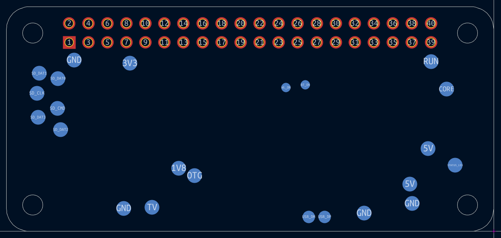
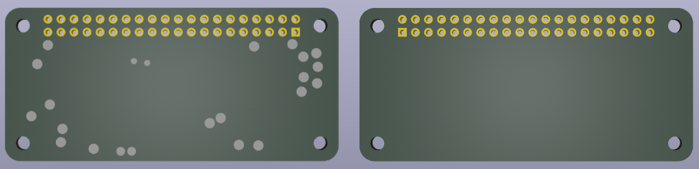

# rpi-zero-2-w-testpads.pretty
*KiCad footprint of Raspberry Pi Zero 2 W's test pads...*

## Screenshots

## Test pad positions (Origin bottom left, flipped horizontally)
|Label     |Function                     |X (mm from origin)|Y (mm from origin)|
|----------|-----------------------------|------------------|------------------|
|STATUS_LED|Power state of LED (LOW = ON)|5.15              |8.8               |
|CORE      |Processor power              |6.3               |18.98             |
|RUN       |Connect to GND to reset      |8.37              |22.69             |
|5V        |5V input                     |8.75              |11.05             |
|5V        |5V input                     |11.21             |6.3               |
|GND       |Ground pin                   |10.9              |3.69              |
|GND       |Ground pin                   |17.29             |2.41              |
|USB_DP    |USB port                     |22.55             |1.92              |
|USB_DM    |USB port                     |24.68             |1.92              |
|OTG       |On-the-go ID pin             |39.9              |7.42              |
|1V8       |1.8V analog supply           |42.03             |8.42              |
|TV        |Composite TV out             |45.58             |3.17              |
|GND       |Ground pin                   |49.38             |3.05              |
|GND       |Ground pin                   |55.99             |22.87             |
|3V3       |3.3V I/O supply              |48.55             |22.44             |
|SD_CLK    |SD Card clock pin            |60.95             |18.45             |
|SD_CMD    |SD Card command pin          |58.2              |16.42             |
|SD_DAT0   |SD data pin                  |58.13             |20.42             |
|SD_DAT1   |SD data pin                  |60.65             |21.1              |
|SD_DAT2   |SD data pin                  |57.78             |13.57             |
|SD_DAT3   |SD data pin                  |60.8              |15.22             |
|BT_ON     |Bluetooth power status       |25.13             |19.55             |
|WL_ON     |Wireless LAN power status    |27.7              |19.2              |

---
- *Based on datasheets from https://www.raspberrypi.com/documentation/computers/raspberry-pi.html*
- *Test pad sizes measured manually*
